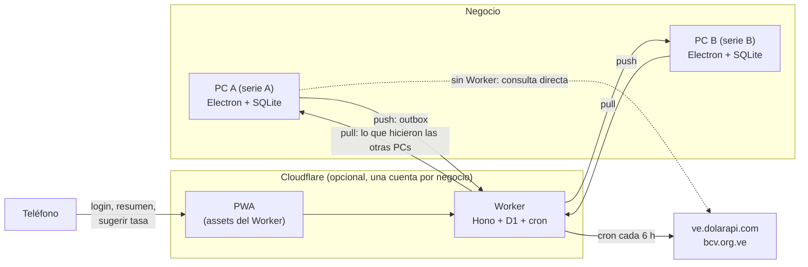

# Arquitectura de Bllt

Este documento explica cómo está construido Bllt y por qué. Está pensado para quien quiera contribuir, auditar el código o hacer un fork. Para usar la app, las guías están en [bllt.juanl.dev](https://bllt.juanl.dev); para instalar y correr el proyecto, en el [README](README.md).

## Qué es y qué no es

Bllt (se lee “billete”) es una app de escritorio para que un negocio pequeño en Venezuela lleve inventario, ventas y clientes en USD, guardando la tasa BCV de cada venta. Funciona 100% sin internet. La nube es opcional y sirve para que varias PCs del mismo negocio compartan sus datos, ver el resumen del día y sugerir la tasa desde el teléfono.

**Hace:** productos con costo y precio en USD, confirmación diaria de la tasa (Bs por USD), ventas con o sin cliente que descuentan inventario, comprobante en PDF, dashboard de ganancias del día y del mes, usuarios con roles, respaldos automáticos y exportación a Excel o CSV.

**No hace:** factura fiscal ni integración con el SENIAT, cobros ni pasarelas de pago, ni multi-tienda. Un negocio puede usar varias PCs, pero todas comparten los mismos datos.

Toda la app trabaja en hora de Venezuela (UTC−4, sin horario de verano).

## Vista general

Cada PC funciona sola y es la fuente de verdad de lo que ella registra: nunca depende de internet para vender. El Worker es el punto de encuentro: cada PC le sube sus cambios y baja los de las otras. También propone la tasa del día, pero el escritorio nunca la aplica sin que un usuario la confirme.

Si la conexión cae, cada PC acumula sus cambios en el outbox y los sube al volver, y baja lo que se perdió. Sin Worker configurado, el escritorio consulta la tasa directamente a las APIs públicas o el usuario la escribe a mano.

Antes de crear un componente se revisa si existe en shadcn-svelte, y si no, si hay una primitiva de Bits UI sobre la cual construirlo. Solo se escribe desde cero cuando ninguno lo cubre, y vive en `@bllt/ui` si lo usa más de una app.

## Modelo de datos

El esquema está definido con Drizzle en `packages/shared/src/schema` y es el mismo en SQLite (escritorio) y D1 (nube):

- `schema/index.ts`: las tablas compartidas.
- `schema/desktop.ts`: además `outbox`, `settings`, `devices` y `sync_conflicts`.
- `schema/cloud.ts`: además `devices` (con el hash del token), `changes`, `rate_candidates`, `cloud_meta` y `login_attempts`.

| Tabla               | Dónde      | Notas                                                                                                                                                                                |
| ------------------- | ---------- | ------------------------------------------------------------------------------------------------------------------------------------------------------------------------------------ |
| `users`             | ambas      | Hash PBKDF2 con `salt` e `iterations`. Roles `ADMIN` y `EMPLOYEE`. Se desactiva, nunca se borra.                                                                                     |
| `products`          | ambas      | Costo y precio actuales en centavos. El histórico vive en las líneas de venta. `stock` es una caché local (suma de sus movimientos) y no se sincroniza.                              |
| `customers`         | ambas      | Nombre, cédula o RIF y teléfono. Opcional en la venta.                                                                                                                               |
| `exchange_rates`    | ambas      | Una fila por día de negocio, y solo cuando un usuario la confirma. `source`: `WORKER`, `PUBLIC_API`, `MANUAL` o `WEB`.                                                               |
| `sales`             | ambas      | La venta es la factura: `series` de la PC y `number` correlativo dentro de la serie (`A-000123`), `rate` del momento, `status` `COMPLETED` o `VOIDED`. Sin `customer_id` es anónima. |
| `stock_movements`   | ambas      | Solo inserción: `delta`, `reason` (`INITIAL`, `SALE`, `VOID`, `PURCHASE`, `ADJUSTMENT`), `ref_id` y `device_id`. El stock de un producto es la suma de sus movimientos.              |
| `business_settings` | ambas      | Ajustes que comparten todas las PCs: nombre, RIF y logo del negocio y el hash del código de recuperación. Gana el cambio más reciente.                                               |
| `devices`           | ambas      | Las PCs del negocio: `series`, nombre, `active` y última conexión. En D1 guarda además el hash del token de cada una.                                                                |
| `sync_conflicts`    | escritorio | Casos que el sync resolvió solo (código repetido, usuario repetido, administrador reactivado...) para que el admin los revise.                                                       |
| `changes`           | nube       | Un registro por cambio aceptado, con `seq` asignado por el servidor. Es el cursor con el que las PCs bajan lo que hicieron las demás.                                                |
| `sale_items`        | ambas      | Copia del código, nombre, precio y costo del producto al vender, así las ganancias pasadas nunca cambian.                                                                            |
| `outbox`            | escritorio | Cambios pendientes de subir (`sent_at` nulo).                                                                                                                                        |
| `settings`          | escritorio | URL del Worker, token de esta PC cifrado, id y serie de esta PC, cursor del pull, carpeta de respaldos y copias locales de nombre y logo.                                            |
| `rate_candidates`   | nube       | Tasas propuestas por el cron o el teléfono, con la decisión que tomó el escritorio.                                                                                                  |
| `cloud_meta`        | nube       | Clave/valor: nombre del negocio, hora del último sync.                                                                                                                               |
| `login_attempts`    | nube       | Intentos fallidos de login, para el límite de intentos.                                                                                                                              |

**Reglas**

- Todos los IDs son UUID generados en el escritorio, así el sync es un `upsert` idempotente.
- USD en centavos (`INTEGER`). La tasa es un entero escalado a 4 decimales (`RATE_SCALE = 10_000`). Nada de floats para dinero.
- Los enums van en mayúsculas y se definen una sola vez en `packages/shared/src/enums.ts`.
- Los timestamps se guardan en UTC (ISO 8601). El día de negocio se calcula siempre en UTC−4 con `businessDate()`, nunca con la zona horaria de la PC.
- Una venta, sus líneas, sus movimientos de stock y su fila de outbox se escriben en una sola transacción.
- **Stock:** nadie escribe `products.stock` directamente. Toda escritura crea un movimiento (`stockService.record`): la venta un `SALE` por línea, la anulación un `VOID` con id determinista (así, si dos PCs anulan la misma venta, el stock vuelve una sola vez), el formulario de producto un `ADJUSTMENT` por la diferencia. Si dos PCs venden la última unidad sin conexión el stock queda negativo, y el dashboard avisa.
- **Quién gana al editar:** usuarios, productos, clientes, tasas y ajustes compartidos llevan `updated_at` y `updated_by_device`; gana el más reciente, y si empatan, el `device_id` mayor (`packages/shared/src/lww.ts`, la usan el escritorio y el Worker). El Worker recorta un `updated_at` más de 24 horas en el futuro. Las ventas no se editan: lo único que pasa es `COMPLETED → VOIDED`, y `VOIDED` siempre gana.
- No se registra ninguna venta sin una fila en `exchange_rates` para el día de negocio actual.
- Ganancia de una línea = `qty × (price_cents − cost_cents)`. En Bs se multiplica por la `rate` de su propia venta. El cálculo vive solo en `summarizeProfit` (`packages/shared/src/profit.ts`), así el escritorio y el teléfono muestran el mismo número.
- Anular una venta cambia su `status` a `VOIDED` y devuelve el stock. No se borran filas.
- **Unicidad:** el usuario y el par `(serie, número)` de la venta son únicos solo en el escritorio (`apps/desktop/drizzle/0001_desktop_unique.sql` y `0003_*`). D1 nunca rechaza una fila del escritorio. El código de producto no es único en ninguna parte: dos PCs pueden crear el mismo offline, y el sync deja el código al producto de `id` menor y renombra el otro a `CODIGO-2` en todas las PCs por igual.

**Migraciones:** las dos salen del mismo esquema. Las del escritorio están en `apps/desktop/drizzle` (`pnpm --filter @bllt/desktop db:generate`) y se aplican al abrir la app. Antes de migrar una base con datos, `core/migrate.ts` guarda una copia (`premigracion-….db`, junto a los respaldos, que la limpieza diaria no borra); después convierte los datos de una sola vez (el stock existente pasa a un movimiento `INITIAL` por producto, las filas se marcan con el id de esta PC) y compara conteos y totales: si algo no coincide, la app no abre. Una instalación nueva, o una PC que se une a un negocio, nunca crea movimientos `INITIAL`: los recibe del Worker. Las de D1 están en `apps/worker/migrations` (`pnpm --filter @bllt/worker db:generate`) y se aplican en el deploy.

## App de escritorio

`apps/desktop`: Electron con electron-vite para desarrollar y electron-builder para empaquetar.

**Procesos**

- **Main** (`src/main`): abre SQLite con `better-sqlite3` y Drizzle, corre las migraciones, registra los adaptadores IPC y arranca los trabajos de fondo (sync, respaldo diario, tasa). El usuario con sesión iniciada vive solo aquí (`core/session.ts`).
- **Preload** (`src/preload`): expone con `contextBridge` funciones concretas en `window.api`, nunca la base ni `ipcRenderer` completo.
- **Renderer** (`src/renderer`): la UI en Svelte, con `contextIsolation: true`, `nodeIntegration: false` y `sandbox: true`. La navegación externa se bloquea; los enlaces `https://` se abren en el navegador del sistema.

Cada canal IPC se registra con `handle()` (`core/ipc.ts`), que valida la entrada con Zod, exige sesión y rol, y siempre devuelve un `Result` en vez de lanzar errores al renderer.

**Rutas en disco** (`core/config.ts`): la base viva está en `userData/bllt.db`. Lo que el usuario ve va a `Documentos/Bllt/`, con las carpetas `Backups`, `Exports` y `Receipts`. Las variables `BLLT_USER_DATA_DIR` y `BLLT_DOCUMENTS_DIR` aíslan los datos en pruebas y desarrollo.

**Respaldos:** un respaldo automático al día, la primera vez que se abre la app ese día, con la API `backup` de `better-sqlite3` (segura con la base abierta). Se conservan 7 días. La carpeta se puede cambiar en Configuración. Restaurar pide confirmación y guarda antes una copia de la base actual.

**Exportar:** ventas por rango de días de negocio a `.xlsx` o CSV. Corre en un `utilityProcess` (`modules/exports/export.worker.ts`), así la app sigue vendiendo mientras exporta.

**Comprobante:** `modules/sales/receipt.service.ts` genera un PDF tamaño carta con membrete, pie y aviso de documento no fiscal. Se abre en una vista previa en memoria, y desde ahí se guarda en `Receipts` o se imprime.

**Actualizaciones:** `electron-updater` lee GitHub Releases, con descargas diferenciales gracias a los blockmaps de NSIS.

**Cuidado:** `better-sqlite3` es un módulo nativo y tiene que compilarse para la versión de Electron. El `postinstall` corre `electron-builder install-app-deps`. Si la app no abre con un error de base de datos, eso es lo primero que hay que revisar.

## Worker (Hono + D1)

`apps/worker`: un Worker por negocio, en la cuenta de Cloudflare del propio negocio. Sirve la API bajo `/api/*` y el build de `apps/web` como assets en modo SPA, en el mismo dominio.

| Ruta                             | Quién la llama | Auth         | Qué hace                                                                                                        |
| -------------------------------- | -------------- | ------------ | --------------------------------------------------------------------------------------------------------------- |
| `GET /api/health`                | Escritorio     | Ninguna      | `{ ok, protocol }`: la versión del contrato del sync que entiende este Worker                                   |
| `GET /api/business/status`       | Escritorio     | `SYNC_TOKEN` | Si el negocio ya tiene datos y si la primera PC terminó de subirlos (para unir una PC nueva)                    |
| `POST /api/devices/register`     | Escritorio     | `SYNC_TOKEN` | Registra una PC: le asigna serie y le entrega su propio token (en D1 queda solo su hash)                        |
| `GET /api/devices`               | Escritorio     | Token de PC  | Las PCs del negocio y su última conexión                                                                        |
| `POST /api/devices/:id/revoke`   | Escritorio     | Token de PC  | Desactiva una PC: su token deja de valer                                                                        |
| `POST /api/sync/push`            | Escritorio     | Token de PC  | Recibe un lote del outbox, aplica "gana el último" y anota cada cambio en `changes`. Responde los IDs aceptados |
| `GET /api/sync/pull`             | Escritorio     | Token de PC  | Lo que hicieron las otras PCs desde el cursor (`since`), con el estado actual de cada fila                      |
| `POST /api/sync/upload-complete` | Escritorio     | Token de PC  | La primera PC avisa que terminó la subida inicial                                                               |
| `GET /api/sync/rate`             | Escritorio     | Token de PC  | Devuelve la tasa del cron del día (`internet`) y la sugerencia pendiente del teléfono (`phone`)                 |
| `POST /api/auth/login`           | PWA            | Ninguna      | Valida contra `users` y entrega un JWT en cookie `HttpOnly`                                                     |
| `POST /api/auth/logout`          | PWA            | Cookie       | Borra la cookie                                                                                                 |
| `GET /api/auth/me`               | PWA            | Cookie       | Usuario de la sesión                                                                                            |
| `GET /api/summary`               | PWA            | Cookie       | Ganancias del día y del mes, ventas del día, tasa confirmada y hora del último sync                             |
| `PUT /api/rate`                  | PWA            | Cookie       | Crea una tasa candidata con `source = WEB`                                                                      |
| `GET /api/business`              | PWA            | Ninguna      | Nombre del negocio (también sale en la pantalla de login)                                                       |
| `/manifest.webmanifest`          | Navegador      | Ninguna      | El manifest de la PWA con el nombre del negocio                                                                 |

**Configuración** (`apps/worker/wrangler.jsonc`)

- Secrets: `SYNC_TOKEN` (solo sirve para registrar PCs) y `JWT_SECRET`.
- Assets con `not_found_handling: single-page-application`. Solo `/api/*` y el manifest pasan primero por el Worker.
- Cron `0 4,10,16,22 * * *`: cada 6 horas en hora de Venezuela (00, 06, 12 y 18 UTC−4), porque Cloudflare evalúa los crons en UTC. Guarda la tasa en `rate_candidates`, nunca en `exchange_rates`.
- Sin CORS (la PWA está en el mismo origen), `secureHeaders` en todo y middleware `csrf` en `/auth/*` y `/rate`.
- Sin endpoint de registro: los usuarios solo llegan desde el escritorio por el sync.

`pnpm --filter @bllt/worker build` compila `apps/web` y lo copia a `apps/worker/public`, así el negocio no tiene que hacer nada más.

### Despliegue: la rama `cloud`

El botón “Deploy to Cloudflare” copia un solo directorio al repo nuevo del negocio, y `apps/worker` solo no alcanza: depende de `@bllt/shared`, y su build compila `apps/web` con `@bllt/ui`. Por eso `scripts/cloud-branch.mjs` genera un workspace recortado con esos cuatro paquetes y `wrangler.jsonc` en la raíz, y el workflow `cloud-branch.yml` lo publica en la rama `cloud`.

- La rama `cloud` se publica **solo desde el último tag estable `vX.Y.Z`**, igual que el instalador, para que los negocios nunca corran código sin release. Un push a `main` solo comprueba que compila. Los tags viejos o de prueba (`v1.3.0-beta`) no reemplazan lo publicado.
- `.bllt-version` guarda el tag publicado.
- La rama trae `.github/workflows/update-cloud.yml` y `scripts/update.mjs` (fuentes en `scripts/cloud/`). Con ese Action, cada negocio trae la última versión conservando el nombre de su Worker, el id de su D1 y las rutas de su `wrangler.jsonc`. Guía: `/docs/guias/actualizar-nube`.

## App web (PWA)

`apps/web`: Svelte + Vite sin SvelteKit, compilada a estáticos y servida por el Worker de cada negocio. Tiene tres pantallas: login, resumen del día y sugerir tasa.

- `vite-plugin-pwa` genera el service worker. El Worker reescribe el manifest con el nombre del negocio que sincronizó el escritorio (`modules/pwa/pwa.service.ts`), sin variables de compilación.
- Sin conexión, muestra el último resumen guardado en `localStorage` con la hora a la que se actualizó. Ese caché no contiene credenciales.
- La sesión va en una cookie `HttpOnly`, `Secure` y `SameSite=Strict`. No se guardan tokens en `localStorage`.
- Sugerir la tasa necesita conexión y crea una candidata. El escritorio decide si la acepta, y si la rechaza, la PWA lo muestra.

## Sitio (landing y documentación)

`apps/site`: SvelteKit con `adapter-static`, todo prerenderizado. Las guías son Markdown con mdsvex en `src/content/docs`. Rutas: `/` (landing con video de demo y descarga del último release), `/docs/*`, `/licencia` y `/novedades` (sale de `src/lib/changelog.json`).

Lo publica Cloudflare Workers Builds en cada push a `main` (Worker `bllt-site`, dominio `bllt.juanl.dev`, config en `apps/site/wrangler.jsonc`). El Worker de cada negocio nunca sirve el sitio.

## Sincronización

Cada PC sube sus cambios y baja los de las otras a través del Worker. Una PC nunca habla con otra directamente, y cualquiera puede pasar horas sin conexión.

**Dispositivos.** Cada instalación tiene un `device_id` (UUID) y una serie de una letra que usa en sus facturas. Se registra en el Worker con el `SYNC_TOKEN`, que solo sirve para eso: el Worker le asigna la serie (la PC original, que ya tiene ventas, pide la `A`) y le entrega su propio token, del que guarda solo el hash. La PC lo guarda cifrado con `safeStorage` y descarta el `SYNC_TOKEN`. Si roban una PC se desactiva sola desde otra (**Configuración → Nube**) y recibe 401.

**Subida (outbox)** — `apps/desktop/src/main/modules/sync/sync.service.ts`

1. Cada escritura relevante llama a `syncService.enqueue()` dentro de la misma transacción. La fila guarda una foto JSON de la entidad (una venta incluye sus líneas; un producto no incluye su stock).
2. Cada 45 segundos, y a mano desde el botón de sincronizar, el main pide `GET /api/health` para conocer el protocolo del Worker. Uno anterior al 3 no puede sincronizar y la app avisa que hay que actualizarlo.
3. Envía lotes de hasta 100 mensajes (`SYNC_BATCH_SIZE`) a `POST /api/sync/push` con el token de la PC.
4. El Worker valida con el mismo esquema Zod y aplica cada mensaje con la regla de su entidad (ver el modelo de datos) en un `batch` atómico de D1, anotando en `changes` cada cambio de las entidades compartidas. El plan gratis de D1 limita las consultas por invocación, así que acepta solo el prefijo que cabe en `SYNC_STATEMENT_BUDGET` (40) y responde esos IDs.
5. El escritorio marca esos IDs con `sent_at` y sigue enviando mientras el Worker acepte algo. Si la conexión cae a mitad de camino se reenvían, y la regla de cada entidad es idempotente.

**Bajada (pull)**

1. Tras la subida, `GET /api/sync/pull?since=<seq>&limit=50` devuelve lo que hicieron las demás PCs. El cursor `seq` lo asigna el servidor: el reloj de las PCs nunca decide qué bajar. La respuesta trae el estado **actual** de cada fila tocada (una fila cambiada varias veces viaja una vez), `nextSeq`, `hasMore` y cuántos cambios faltan.
2. `applyService.applyBatch` aplica el lote en **una transacción junto con el cursor**, así un corte nunca deja algo a medias. Lo que baja **nunca** entra al outbox (si no, volvería al Worker en un bucle). Solo entran las correcciones que el propio sync hace.
3. Reglas al aplicar: se ignora el `stock` de los productos y se reconstruye desde los movimientos; un movimiento que ya existe se ignora; "gana el último" para las filas editables; `VOIDED` gana en las ventas.
4. Casos que el sync resuelve solo y deja anotados en `sync_conflicts` (avisan al admin en el dashboard): código de producto repetido, usuario repetido (se renombra el de `id` mayor), cliente con la misma cédula, número de venta repetido tras restaurar un respaldo, y último administrador desactivado (se reactiva el desactivado más recientemente).
5. Tras restaurar un respaldo el cursor vuelve atrás y la PC pide además sus propios cambios (`includeOwn`): lo que había subido después del respaldo sigue en el Worker y regresa. Lo que no alcanzó a subir se pierde en esa PC.

**Primera conexión.** Una PC que ya tiene datos (la original) se conecta desde **Configuración → Nube**: se registra, vacía lo que había en el outbox de ese tipo, lo reconstruye desde las tablas y lo sube todo una vez, con progreso. Al terminar avisa a `POST /api/sync/upload-complete`. Una PC nueva abre la app, pone la URL y el `SYNC_TOKEN` en la primera pantalla y, si el negocio ya tiene datos (y la primera PC terminó), baja todo y entra al login con los usuarios descargados, sin crear un dueño nuevo ni pedir otro código de recuperación.

**Versión del protocolo:** cada negocio despliega su propia copia del Worker y puede no actualizarla. `SYNC_PROTOCOL` (en `packages/shared/src/sync.ts`) sube cada vez que cambia el contrato; `ENTITY_PROTOCOL` dice desde qué versión existe cada entidad del outbox.

**Tasa (bajada desde el Worker):** en cada ciclo el escritorio pide `GET /api/sync/rate` y recibe dos opciones, la tasa de internet (el cron) y la sugerencia del teléfono. Ninguna se aplica sola:

- Si difiere de la confirmada, aparece un aviso con la tasa guardada, la nueva, su origen y la hora. El usuario la acepta o la descarta.
- Aceptar crea o actualiza la fila de `exchange_rates`, que sube por el outbox. La decisión sobre una sugerencia del teléfono sube como `RATE_DECISION`.
- Una candidata descartada no vuelve a mostrarse. Si el cron trae el mismo valor, conserva el id para que el descarte siga valiendo.
- Las sugerencias del teléfono vencen a la 1:00 am (UTC−4) del día siguiente (`phoneSuggestionCutoff()`).
- Las ventas ya hechas conservan su propia `rate`, así que un cambio de tasa nunca altera el pasado.
- La tasa que confirma una PC llega a las demás por el pull como una fila más de `exchange_rates` (gana la última confirmación) y vale como confirmada: las otras PCs no vuelven a pedirla.

El dashboard muestra el estado del sync: cuándo subió y bajó por última vez, cuántos cambios faltan en cada sentido (con progreso durante la subida inicial) y hasta cuándo llegaron los datos de las otras PCs.

## Tasa BCV

No hay API oficial del BCV. Las fuentes disponibles leen bcv.org.ve por debajo, así que la tasa automática siempre es una sugerencia y la manual siempre está disponible.

`packages/shared/src/rate-providers.ts` prueba las fuentes en orden y devuelve la primera que responda:

1. `ve.dolarapi.com`, una API comunitaria y gratuita (la fuente por defecto).
2. Scraping directo de `bcv.org.ve` como último recurso. Se rompe si cambia el HTML del BCV.

Lo usan el cron del Worker y, sin Worker, el escritorio al abrir y al pulsar “buscar tasa”.

**Reglas**

- La primera apertura de cada día de negocio pide confirmar la tasa. Sin tasa confirmada ese día no se registran ventas (`rateService.requireToday()`).
- La tasa del día es la que confirma un usuario. Se guarda con la fecha del día de negocio en que se confirmó, sin importar la fecha valor que publique el BCV, que se muestra solo como dato informativo.

## Autenticación y seguridad

La auth está hecha a mano, sin librerías externas. Hay dos credenciales distintas: la de cada persona y el token de cada PC.

| Acción                                                   | `ADMIN` | `EMPLOYEE` |
| -------------------------------------------------------- | ------- | ---------- |
| Vender, productos, clientes, confirmar tasa, dashboard   | Sí      | Sí         |
| Anular ventas                                            | Sí      | No         |
| Crear, desactivar y resetear usuarios                    | Sí      | No         |
| Configurar nube, respaldos, datos del negocio y exportar | Sí      | No         |

- **Contraseñas:** PBKDF2-SHA256 con Web Crypto, 100.000 iteraciones por defecto (`packages/shared/src/password.ts`). El mismo formato (`password_hash`, `salt`, `iterations`) funciona en Node y en Workers, así un usuario creado en el escritorio puede iniciar sesión en el teléfono.
- **Primer arranque:** si no hay usuarios, la app crea al owner (`ADMIN`) y muestra un código de recuperación para anotarlo en papel. Solo se guarda su hash. Sirve para resetear la contraseña de un admin desde el escritorio.
- **Escritorio:** el login local contra SQLite es un bloqueo de pantalla, no protege el archivo. Quien tenga acceso a la PC puede abrir el `.db`.
- **`SYNC_TOKEN` y token de PC:** el `SYNC_TOKEN` solo registra PCs y no se guarda en ninguna. Cada PC recibe su propio token, que se guarda cifrado con `safeStorage` de Electron (DPAPI en Windows); el Worker guarda solo su SHA-256. El `SYNC_TOKEN` se compara en tiempo constante.
- **Teléfono:** el Worker firma un JWT HS256 (`sub`, `role`, 30 días) con `JWT_SECRET` y lo entrega en cookie. Cada request revisa que el usuario siga `active`, así que un empleado desactivado pierde la sesión en cuanto llega el sync.
- **Límite de intentos:** 5 logins fallidos en 15 minutos bloquean temporalmente (`login_attempts` en D1).
- **Teléfono perdido:** rotar `JWT_SECRET` cierra todas las sesiones.

## Pruebas y CI

- `pnpm --filter @bllt/shared test`: pruebas unitarias con Vitest de dinero, hora, ganancias, contraseñas y la regla de "gana el último".
- `pnpm --filter @bllt/worker test`: pruebas del Worker con Vitest sobre un D1 de mentira hecho con `node:sqlite` y las migraciones reales (dispositivos, "gana el último", ventas y stock, pull).
- `pnpm --filter @bllt/desktop test:data`: migra una base de la versión anterior y aplica cambios de otra PC con el código real, bajo Electron-como-Node (por el ABI de `better-sqlite3`).
- `pnpm --filter @bllt/desktop test:e2e`: prueba de humo con Playwright (`_electron`) sobre la app construida. Recorre primer arranque, tasa, productos, venta, dashboard y respaldo. Con `BLLT_E2E_WORKER` y `BLLT_E2E_TOKEN` prueba también la conexión a un Worker local. `e2e/multi.mjs` levanta dos PCs contra un Worker local con la base vacía: una conecta, la otra se une, venden las dos y se comprueban stock, series, anulaciones y la desactivación de una PC.
- `ci.yml`: typecheck de todos los paquetes, pruebas de `shared` y builds de `web` y `site` en cada PR y push a `main`.
- `release-desktop.yml`: con un tag `v*`, compila el instalador NSIS de Windows, genera las notas desde el changelog y publica el release en GitHub.
- `cloud-branch.yml`: publica la rama `cloud` desde el último tag estable.
- `scripts/changelog.mjs`: genera `CHANGELOG.md` y `apps/site/src/lib/changelog.json` desde los tags y los commits. No se editan a mano.

## Distribución

- Windows 10 primero, con instalador NSIS. Sin certificado de firma, SmartScreen muestra una advertencia, y la guía de instalación explica cómo continuar.
- El escritorio se publica en GitHub Releases y se actualiza solo. La landing enlaza siempre al último release.
- El Worker no se despliega desde el CI del proyecto: cada negocio lo despliega en su cuenta con el botón.
- Nombres fijos: repositorio `juanlvs21/bllt`, appId `dev.juanl.bllt`, sitio `bllt.juanl.dev`.

## Licencia y marca

El código está bajo la [Apache License 2.0](LICENSE). Su sección 6 no concede permiso para usar nombres comerciales ni logos, así que el nombre “Bllt”, el logo y la identidad visual quedan fuera de la licencia ([TRADEMARKS.md](TRADEMARKS.md), [assets/brand/README.md](assets/brand/README.md)). Un fork tiene que cambiar el nombre, el logo, los íconos, el appId y las URLs de actualización y del sitio, y conservar el [NOTICE](NOTICE).
