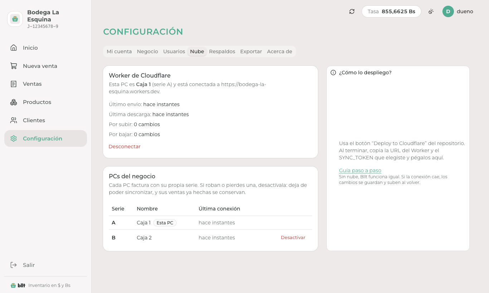
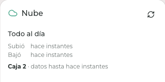

<p align="center">
  <a href="https://bllt.juanl.dev">
    <picture>
      <source media="(prefers-color-scheme: dark)" srcset="assets/brand/logo-dark.svg" />
      
    </picture>
  </a>
</p>

<p align="center">
  Inventario, ventas y clientes en dólares con la tasa BCV de cada venta. Funciona sin internet.
</p>

<p align="center">
  <a href="https://github.com/juanlvs21/bllt/releases/latest"></a>
  <a href="https://github.com/juanlvs21/bllt/releases"></a>
  <a href="https://github.com/juanlvs21/bllt/actions/workflows/ci.yml"></a>
  <a href="https://github.com/juanlvs21/bllt/actions/workflows/release-desktop.yml"></a>
  <a href="LICENSE"></a>
  
  <a href="https://bllt.juanl.dev"></a>
</p>

<p align="center">
  <a href="https://github.com/juanlvs21/bllt/releases/latest"><b>Descargar</b></a> ·
  <a href="https://bllt.juanl.dev/docs/instalacion">Instalación</a> ·
  <a href="https://bllt.juanl.dev/docs/guias/primer-arranque">Guías</a> ·
  <a href="https://bllt.juanl.dev/docs/nube">Nube (opcional)</a> ·
  <a href="https://github.com/juanlvs21/bllt/issues">Reportar un problema</a>
</p>

<p align="center">
  
</p>

**Bllt** (se lee “billete”) es una app de escritorio open source para que un negocio pequeño en Venezuela controle inventario, ventas y clientes en USD, registrando la tasa BCV de cada venta. Funciona 100% sin internet; la nube es opcional y sirve para usar **varias PCs con los mismos datos**, ver el resumen y sugerir la tasa desde el teléfono.

## Capturas

| Tasa del día | Productos |
| --- | --- |
|  |  |
| **Nueva venta** | **Factura** |
|  |  |
| **Varias PCs** | **Estado de la nube** |
|  |  |

## Documentación

Guías completas en [bllt.juanl.dev](https://bllt.juanl.dev):

- [Instalar en Windows](https://bllt.juanl.dev/docs/instalacion)
- [Primer arranque](https://bllt.juanl.dev/docs/guias/primer-arranque)
- [Confirmar la tasa del día](https://bllt.juanl.dev/docs/guias/tasa-del-dia)
- [Registrar una venta](https://bllt.juanl.dev/docs/guias/ventas)
- [Usuarios y roles](https://bllt.juanl.dev/docs/guias/usuarios)
- [Respaldos](https://bllt.juanl.dev/docs/guias/respaldos)
- [Exportar ventas](https://bllt.juanl.dev/docs/guias/exportar)
- [Nube en Cloudflare (opcional)](https://bllt.juanl.dev/docs/nube) y [usar varias PCs](https://bllt.juanl.dev/docs/guias/varias-pcs)
- [Instalar en el teléfono](https://bllt.juanl.dev/docs/guias/telefono) y [si pierdes el teléfono](https://bllt.juanl.dev/docs/guias/telefono-perdido)

## Nube opcional

[](https://deploy.workers.cloudflare.com/?url=https://github.com/juanlvs21/bllt/tree/cloud)

El botón despliega la rama `cloud`, que CI publica desde el último tag estable `vX.Y.Z`, igual que el instalador del escritorio, para que los negocios nunca corran código sin release (`scripts/cloud-branch.mjs`, workflow `cloud-branch.yml`; un push a `main` solo comprueba que compila): un workspace recortado con `apps/worker`, `apps/web`, `packages/shared` y `packages/ui`, y `wrangler.jsonc` en la raíz, porque el botón copia un solo directorio al repo nuevo. Incluye la API (Hono + D1), el cron de la tasa y la PWA del teléfono. Pide dos secretos, `SYNC_TOKEN` y `JWT_SECRET`. Con ella, varias PCs del mismo negocio comparten productos, clientes, usuarios, ventas e inventario: cada una sigue funcionando sin internet, sube sus cambios al Worker y baja los de las demás. Una segunda PC se une desde su primera pantalla y carga todo sin repetir la configuración; cada PC tiene su token y su serie de factura (`A-000123`, `B-000045`). Guía: [Usar varias PCs](https://bllt.juanl.dev/docs/guias/varias-pcs). El nombre del negocio en la PWA es el del escritorio: se sincroniza como una entidad más del outbox, la PWA lo pide a `/api/business` y el Worker lo pone en el manifest. Guía: [bllt.juanl.dev/docs/nube](https://bllt.juanl.dev/docs/nube).

## Monorepo

Cómo encaja cada pieza y por qué: [ARCHITECTURE.md](ARCHITECTURE.md).

```
apps/
  desktop/   Electron + electron-vite + Svelte (fuente de verdad, SQLite)
  worker/    Cloudflare Worker: Hono + D1 + cron; sirve el build de apps/web
  web/       PWA Svelte + Vite: login, resumen del día, sugerir tasa
  site/      SvelteKit estático: landing + docs (bllt.juanl.dev)
packages/
  shared/    @bllt/shared: enums, Zod, esquema Drizzle, dinero, hora UTC−4, contrato del sync, ganancias
  ui/        @bllt/ui: componentes shadcn-svelte + piezas de marca
assets/brand/  logo e íconos en SVG/PNG (todos los derechos reservados)
```

Requisitos: Node 22+ y pnpm 11.

```bash
pnpm install
```

| Comando | Qué hace |
| --- | --- |
| `pnpm dev:desktop` | App de escritorio con recarga en caliente |
| `pnpm dev:worker` | Worker local en `:8787` con D1 local (copia `apps/worker/.dev.vars.example` a `.dev.vars`) |
| `pnpm dev:web` | PWA en Vite, con `/api` apuntando al Worker local |
| `pnpm dev:site` | Landing y docs |
| `pnpm typecheck` | Tipos en todos los paquetes |
| `pnpm --filter @bllt/shared test` | Pruebas de dinero, hora, ganancias y contraseñas |
| `pnpm --filter @bllt/desktop test:e2e` | Prueba de humo con Playwright sobre la app construida (primer arranque → tasa → productos → venta → dashboard → respaldo). Con `BLLT_E2E_WORKER=http://localhost:8787` también prueba el sync |
| `node apps/desktop/e2e/multi.mjs` | Dos PCs contra un Worker local con base vacía (`BLLT_E2E_WORKER` y `BLLT_E2E_TOKEN`; construye antes con `pnpm --filter @bllt/desktop build`): unirse, vender en las dos, anular y desactivar una PC |
| `pnpm --filter @bllt/desktop seed:demo` | Llena la base local con datos de demo (40 productos, 38 clientes, tasas y ~90 días de ventas). Cierra Bllt antes; `--reset` reemplaza los datos, `--help` muestra las opciones. Guarda una copia de la base antes de escribir y no toca el outbox |
| `pnpm --filter @bllt/desktop capturas` | Regenera las capturas del README y la landing (`apps/site/static/capturas`) sobre una base temporal con los datos de demo. Necesita un Worker local con base vacía (`BLLT_E2E_WORKER` y `BLLT_E2E_TOKEN`) para las capturas de la nube |
| `pnpm --filter @bllt/desktop build:win` | Instalador NSIS |

## Decisiones clave

Resumen de lo esencial. El detalle (sync, tasa, autenticación, modelo de datos y despliegue) está en [ARCHITECTURE.md](ARCHITECTURE.md). Si trabajas con un agente de código, las convenciones del repo están en [AGENTS.md](AGENTS.md).

- **Dinero:** USD en centavos (`INTEGER`), tasa como entero escalado a 4 decimales. Ganancia de una línea = `qty × (price − cost)`; en Bs se multiplica por la tasa de su propia venta. Se calcula solo en `@bllt/shared` (`summarizeProfit`), así el escritorio y el teléfono muestran el mismo número.
- **Hora:** todo “día de negocio” se calcula en UTC−4 desde UTC con `businessDate()`, nunca con la zona de la PC.
- **Sync:** outbox en la misma transacción que cada escritura; sube en lotes con el token propio de cada PC (el `SYNC_TOKEN` solo sirve para registrarla) y baja los cambios de las demás PCs. Gana el último cambio en productos, clientes, usuarios y tasas; el inventario viaja como movimientos de stock y las ventas anuladas nunca vuelven a completadas. D1 limita las consultas por invocación en el plan gratis, así que el Worker acepta el prefijo del lote que cabe en `SYNC_STATEMENT_BUDGET` y el escritorio reenvía el resto.
- **Unicidad:** usuario, código de producto y número de venta son únicos solo en el escritorio (`apps/desktop/drizzle/0001_desktop_unique.sql`). D1 nunca rechaza una fila del escritorio (por ejemplo, números de venta reutilizados tras restaurar un respaldo).
- **Tasa:** la API solo sugiere; la tasa del día es la que confirma un usuario. Sin tasa confirmada no hay ventas.
- **Módulos:** cada app se organiza en `core/ libs/ utils/ modules/<dominio>/{repository, service, ipc|routes}`. Solo los repositories tocan Drizzle.
- **Migraciones:** escritorio en `apps/desktop/drizzle` (`pnpm --filter @bllt/desktop db:generate`), D1 en `apps/worker/migrations` (`pnpm --filter @bllt/worker db:generate`). Ambas salen del mismo esquema en `packages/shared/src/schema`.

## Publicar

- **Escritorio:** crea un tag `vX.Y.Z` y GitHub Actions compila el instalador de Windows y lo publica en Releases (`.github/workflows/release-desktop.yml`).
- **Sitio:** lo publica Cloudflare Workers Builds, conectado al repo de GitHub: cada push a `main` construye `apps/site` y lo despliega con `pnpm exec wrangler deploy` (config en `apps/site/wrangler.jsonc`, Worker `bllt-site`, dominio `bllt.juanl.dev`).

## Licencia y marca

El código está bajo la [Apache License 2.0](LICENSE) (ver también [NOTICE](NOTICE)). El nombre “Bllt”, el logo y la identidad visual son marcas de Juan Villarroel y **no** están cubiertos por la licencia: lee [TRADEMARKS.md](TRADEMARKS.md) antes de publicar un fork.
